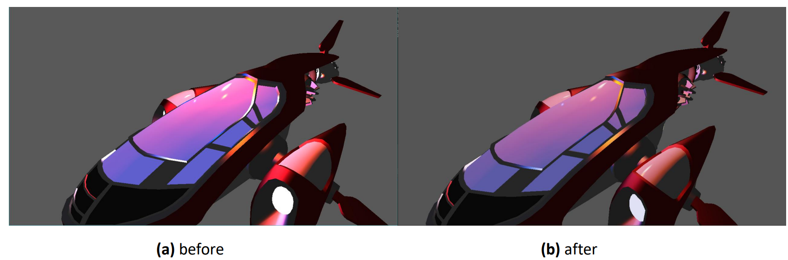
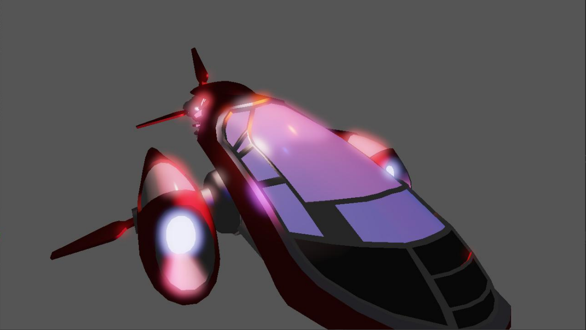
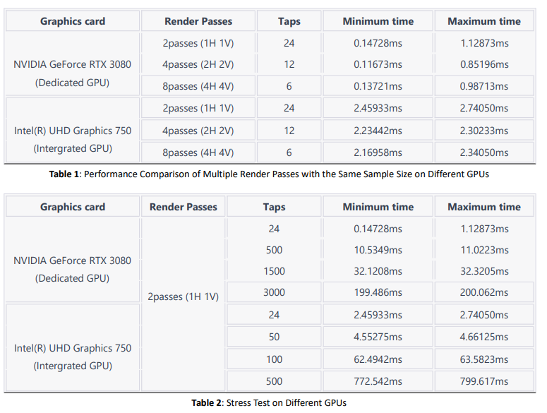

# vk_Gaussian_Blur_Bloom
This project implements Render-To-Texture (RTT), simple Reinhard Tone Mapping, and Bloom based on Gaussian blur.

## Tone Mapping

## Bloom

## Performance Testing
Using vkCmdWriteTimestamp to assess the performance of the bloom effect. In regards to the examination of varying numbers of render passes and taps across different device, the results have been tabulated for easier analysis and comparison. Please refer to Table 1 and Table 2 for a detailed breakdown of these findings.

With table 1, the data suggests that adopting fewer Ktaps and achieving the same effect through multiple convolutions results in comparatively better performance for both high-end discrete GPUs (NVIDIA GeForce RTX 3080) and integrated graphics (Intel(R) UHD Graphics 750). This method of performance optimization is more pronounced. Specifically, for the NVIDIA GeForce RTX 3080, the performance of 8 passes (4H 4V) lies between
0.137216ms and 0.987136ms, and the performance of 4 passes (2H 2V) resides between 0.116736ms and 0.851968ms. Both scenarios outperform the 2-pass configuration, which has a minimum and maximum time of 0.14728ms and 1.12873ms, respectively. This suggests that increasing the number of passes and decreasing Ktaps can enhance performance to a certain extent. This is also true for the
integrated graphics card, Intel(R) UHD Graphics 750. Therefore, according to the test results, I would recommend using fewer Ktaps and achieving the same effect through more convolutions, especially on machines using integrated graphics, where this method of performance optimization is more effective. Additionally, as expected, we can see that increasing the number of taps significantly increases the processing time. This is due to the larger convolution kernel size causing a greater consumption, which increases exponentially. This point can also be seen in Table 2